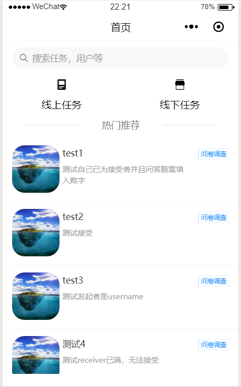
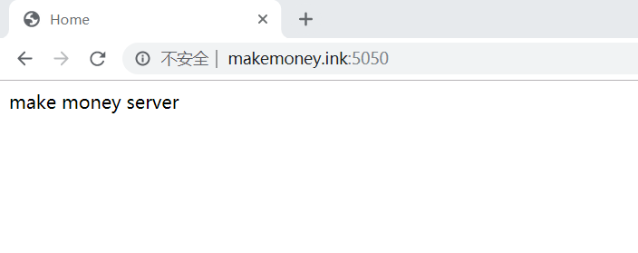

## 安装部署说明

---

### 安装环境 ###

- 前端: 微信小程序
- 后端: 有公网IP的服务器、python3、flask

---


### 安装步骤 ###

- 前端: 
1. 从仓库把代码clone下来
2. 安装微信小程序IDE
3. 在存在wepy.config.js的目录下终端开启编译

   ```
   wepy build --watch
   ```
4. 开启微信小程序导入项目, 目录选择生成的dist文件夹

- 后端:

1. 在server文件夹下安装依赖包

   ```
   pip install -r requirements.txt
   ```

2. 运行服务器

   ```
   flask run
   ```

   

---


### 安装成功的测试方法

- 前端：若能成功渲染首页, 则安装成功:


​	

- 后端：若浏览器成功访问服务器5050端口, 并返回如下页面, 则说明成功:

​	

---


### 常见问题解决方法
暂无

---
