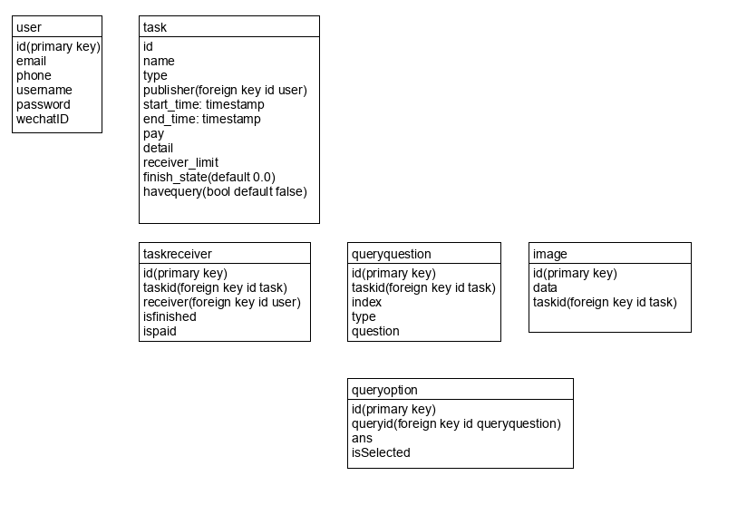

### 数据库说明

---

- 首页推荐任务
  
  param:
  
  1. batch size（返回多少个）
  
  2. userid（用户的id，假如为null，则按照默认推荐，不为null则根据用户兴趣推荐）
     
     实现逻辑： 从task表中，select出publisher≠userid的任务列表，然后根据推荐函数的得分进行排序，从上到下选出batch size个任务

- 查看特定任务详情
  
  param:
  
  1. taskid
     
     实现逻辑：根据taskid，从task表找到对应的task。然后根据taskid，从taskreceiver表中，查找出task_item。然后，从taskreceiver中，根据taskid == param.taskid找出当前task的receivers。然后，假如havequery为true，说明有问卷，从queryquestion表中找出taskid == param.taskid，当前任务的问卷问题的集合。对问卷问题的集合中的每个问题，假如不是问答题，就有选项，根据queryid == queryquestion.id找出问卷这个问题对应的options。然后是图片，查找image表，找到taskid == param.taskid的图片。最后将这些数据组成前端需要的格式返回。

- 返回特定类型的任务
  
  param:
  
  1. type
     
     实现逻辑：查找task表中，type == param.type的任务集合，组合成任务卡需要的数据格式返回

- 我的接单/我的发布
  
  param:
  
  1. page_type
  
  2. task_type
  
  3. userid
     
     实现逻辑：假如task_type是我的接单，那么假如task_type为全部，则查找task表，publisher == param.userid，否则查找publisher == param.userid && type == param.task_type，将返回的任务集合组合成任务卡的数据格式返回。假如task_type是我的发布，则查找taskreceiver表，找到receiver == param.userid的集合，根据集合中的taskid，查找task表 taskid == task.id找到任务列表，组合成任务卡需要的格式返回。

- 增添新任务

- fdsaf
